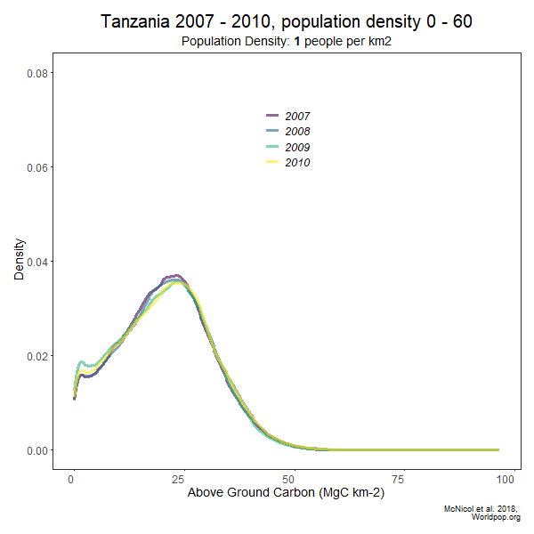

## Here are some example plots I have produced so far


#### contents of these images
- map of tanzania AGC and national parks
- animated density and line plot gifs
- density plots


<br/>
<br/>
<br/>


## maps of Tanzania   


  

 


#### I could investigate how protected areas impact the relationship between population density and AGC density
```
using wdpa package
```
National Parks | Forest Reserves
:-------------------------:|:-------------------------:

    

<br>

----


#### Here are some animations that change simultanuously with population density 
Density plot     |  total agc line
:-------------------------:|:-------------------------:
 | 

<br>

#### What does this actually look like? Here is a freqpoly plot, a histogram
A freqpoly histogram     |  zooming in on 0 - 10, population density
:-------------------------:|:-------------------------:
 | 


<br>


----

### density plot


----


---
